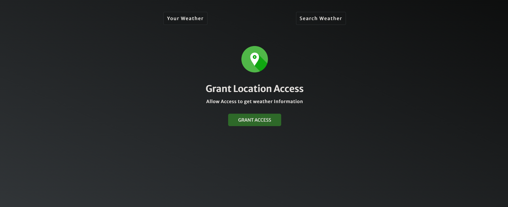
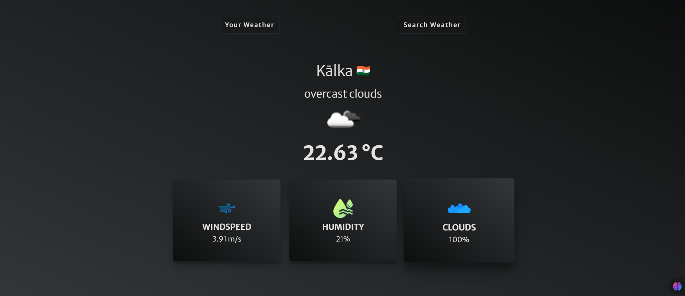

# Weather App

## Overview

A sleek and intuitive weather app built with HTML, CSS, and JavaScript. The app automatically detects your location using geolocation and provides real-time weather updates. Additionally, you can search for weather details of any city worldwide through the search bar.

---

## Features
✅ **Automatic Location Detection** - Fetches weather data for your current location.
✅ **User-Friendly Interface** - Modern, minimalistic design for seamless interaction.
✅ **Real-Time Weather Updates** - Get the latest temperature, wind speed, humidity, and cloud coverage.
✅ **Search Functionality** - Look up weather conditions for any city globally.
✅ **Powered by OpenWeatherMap API** - Ensures precise and up-to-date weather information.

---

## Technologies Used
- **HTML** - Structuring the application.
- **CSS** - Styling for an appealing user experience.
- **JavaScript** - Dynamic functionality and API handling.
- **OpenWeatherMap API** - Fetching real-time weather data.

---

## API Key Setup
1. Sign up at OpenWeatherMap and obtain your API key.
2. Locate the JavaScript file in the project.
3. Find the line where the API key is assigned.
4. Replace `YOUR_API_KEY` with your actual API key.
5. Save the file and refresh the app.
